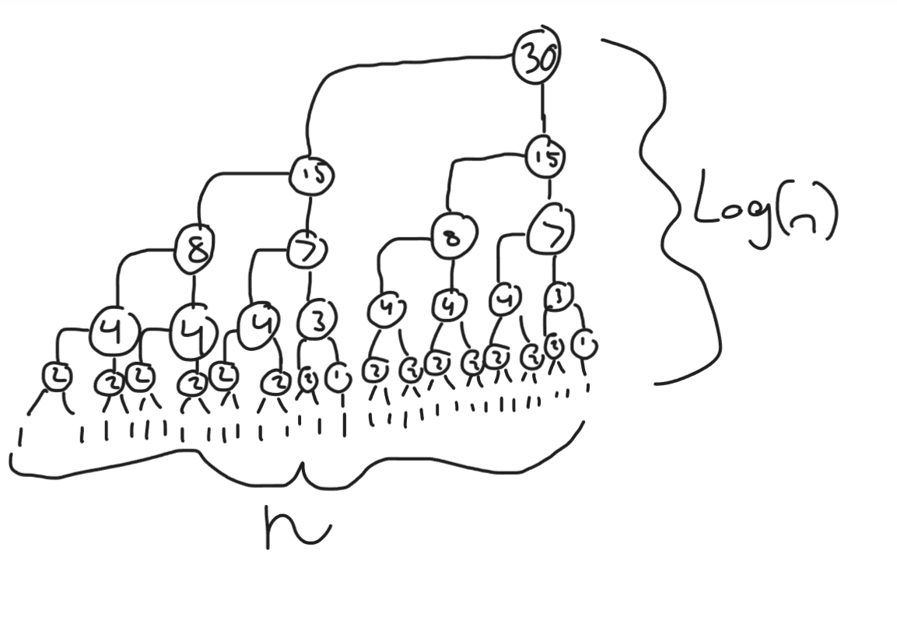

# Parallel Mergesort

Implement a parallel version of mergesort (both the original recursive and the
iterative in-place version from a previous exercise are fine). You may use any
parallelization framework or method.

I have not provided any test code, but you can base yours on test code from
other exercises. Your tests must check the correctness of the result of running
the function and run automatically when you commit through a GitHub action.

## Runtime Analysis

What is the span of the parallel program, in terms of worst-case $\Theta$? Hint:
It may help to consider the DAG of the parallel program.

So my implementation cuts the array in half and sends it to two threads that do the same thing over and over untill they reach the base case. log(n) times because its spliting in half every time. then the merge function takes n time because there are three while loops on the same level, but each thread is only seeing a portion of n(logn).

baised on what i didnt learn in class the span is $log(n)$ because the merge operations build on etchother meaning that there is actually log(n) layers to be worked on in the sequential manner.

So the span of this algorithm is $log(n)$ and the total work is $\theta nlog(n)$.

I started with my original MergeSort implementation for this assignment.

I certify that I have listed all sources used to complete this exercise, including the use of any Large Language Models. All of the work is my own, except where stated otherwise. I am aware that plagiarism carries severe penalties and that if plagiarism is suspected, charges may be filed against me without prior notice.